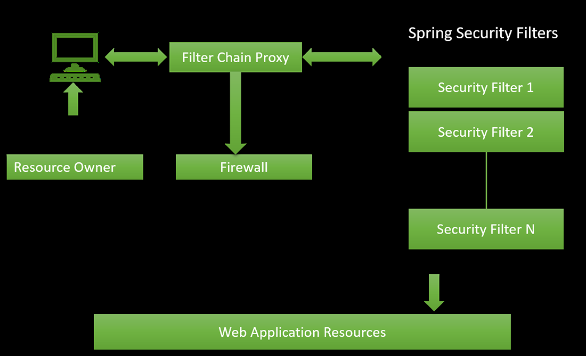

### Spring Security 
The project demonstrates how **Spring Security filters** determine whether the requests invoke by the end-user is private or public. It also **handles the most common security vulnerabilities like CSRF, CORS** etc.
### Dependency used
Spring-boot-starter Web
spring-boot-starter-security

### Internal Architecture

Browser can only understand HTTP protocols, but Java code doesn't understand this protocol. So there is a middle man called *Servlet* or web servers like *Apache Tomcat*who convert the received *HTTP message* into *HTTP solid request object*. All these hectic work is simplified by Springboot.

